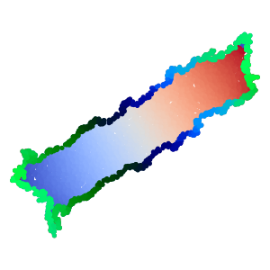

# About

pyRATS is a lightweight Python tool implementing [Riemannian Alignment of Tangent Spaces (RATS)](https://www.biorxiv.org/content/10.1101/2024.10.31.621292v2.abstract) for non-linear dimensionality reduction. 
With the ubiquity of high-dimensional datasets in various natural sciences, identifying low-dimensional topological manifolds within such datasets may reveal principles connecting latent variables to measurable instances in the world. 
While leading dimensionality reduction methods introduce distortion during this process, RATS excels at the visualization and deciphering of latent variables. RATS recovers low-distortion embeddings of data, including the ability to embed closed manifolds into their intrinsic dimension using a tearing process.

# Requirements
pyRATS is available across platforms.
It requires `python >= 3.9` and standard scientific computing packages such as numpy, scipy and sklearn. 
The full list of dependencies is available in the `pyproject.toml` file.

We have tested the package through [GitHub Actions](https://github.com/actions/runner-images) on Ubuntu 24.04, macOS 15 Arm64, and Windows Server 2025.

Local testing was performed on macOS Tahoe 26.5.2.

# Installation
```
pip install git+https://github.com/Mishne-Lab/pyRATS
```

# RATS
RATS applies three main algorithmic steps:
1) It maps locally linear patches of points via (Kernel-)PCA to the embedding space. Postprocessing may be applied on noisy data to remove patches that incur abnormally high distortion. 
2) It clusters points that apply similar transformations to project to the embedding space.
3) It aligns the clusters into a single cluster via rigid alignment.

This bottum-up approach of tearing the manifold apart into smaller clusters allows for leaving the manifold torn.

### Manifold tearing
Closed manifolds can be projected to low dimensional spaces without incurring high distortion only by ripping/ tearing the manifold apart. 
RATS can provide 'gluing' instructions that indicate which two points on the manifold should be glued back together. 
Not only are we able to generate accurate low-dimensional embeddings, this feature allows for manifold denoising by projecting it to lower dimensional spaces and projecting back.

# Example
A list of examples and reproductions are available in the `pyRATS/examples` folder.
A full working example is available [here](https://colab.research.google.com/drive/1nsdjV8lrE5Dg7TI2SZZmWdAMfuFkdw8Q?usp=sharing) on Google Colab.
You can achieve an equivalent output by installing pyRATS, navigating to the `pyRATS/examples` folder and running:
```py
from pyRATS import rats
import datasets, vis 

import time

# sample 5000 datapoints from a kleinbottle manifold in living in 4d space
X, labels, _ = datasets.Datasets().kleinbottle4d(n=5000)

# create a RATS object projecting the data to 2d while tearing the manifold
model = rats.RATS(n_components=2, n_neighbors=28, min_cluster_size=5, tear=True)
start_time = time.time()
y = model.fit_transform(X)
print(f'runtime: {time.time() - start_time} s')

# compute the gluing instructions along the tear
tear_color_eig_inds = [7, 2, 4]
color_of_pts_on_tear = model.compute_color_of_pts_on_tear(y, tear_color_eig_inds)

# plot the resulting 2d representation of the manifold
vis.Visualize().global_embedding(
  y, labels[:,0],
  color_of_pts_on_tear=color_of_pts_on_tear[:,tear_color_eig_inds],
  cmap0='coolwarm',
  figsize=(3, 3)
)
```
runtime: 23.4564 s



# Docs
The documentation can be generated with the following commands:
```bash
pip install sphinx sphinxcontrib-napoleon
cd docs
make html
cd build/html
python -m http.server 8000
```
and opening http://localhost:8000 in your browser.

# Memory Management
`pyRATS` implements dynamic chunking to prevent memory spikes on large or high-dimensional datasets. By default, it attempts to use up to 75% of available system RAM. This measurement can fail and defaults to 4GB otherwise. If you need to explicitly set memory usage, set the `PYRATS_MEMORY_LIMIT` environment variable (in bytes):

```bash
# Set pyRATS memory usage to 40GB
export PYRATS_MEMORY_LIMIT=42949672960
python your_script.py
```


Citation
----------
```
@article{rats,
  title={RATS: Unsupervised manifold learning using low-distortion alignment of tangent spaces},
  author={Kohli, Dhruv and Nieuwenhuis, Johannes S and Cloninger, Alexander and Mishne, Gal and Narain, Devika},
  journal={bioRxiv},
  pages={2024--10},
  year={2024},
  publisher={Cold Spring Harbor Laboratory}
}
```
